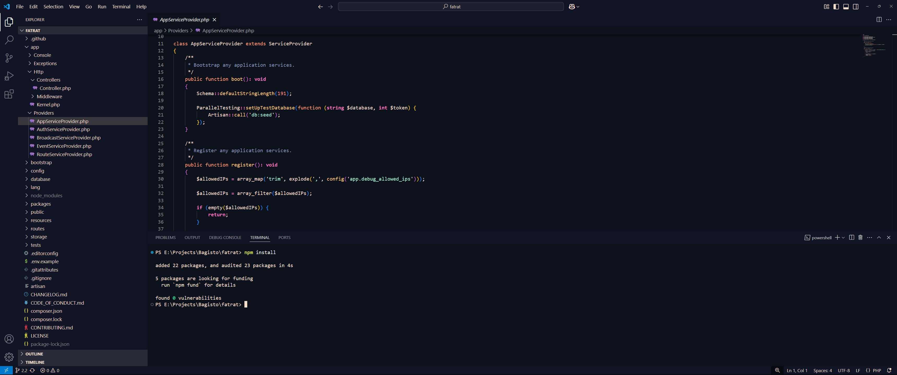

Futuristic Retro Dark – A High-Contrast VS Code Theme
Created by Aayush Bhatt

🚀 A sleek dark theme with a retro-futuristic aesthetic, blending modern minimalism with nostalgic neon vibes. Designed for developers who love a visually striking yet comfortable coding experience.

🔥 Features
✅ Dark Cyberpunk Look – A fusion of deep shadows and glowing highlights for a futuristic feel.
✅ Seamless UI Integration – Aesthetic consistency across VS Code, including the sidebar, terminal, and menus.
✅ Optimized Code Readability – Carefully selected syntax highlighting for high visibility.
✅ Blended Terminal Experience – Terminal colors harmonized with the theme.

📸 Preview

🎨 Color Palette
Background: #0D111C (Deep space dark)
Text: #F3DDCD (Soft neon beige)
Selection: #1D2538 (Subtle glow effect)
Keywords: #FF79C6 (Vibrant cyberpink)
Strings: #A1EFD3 (Electric green)
Functions: #FFC777 (Golden amber glow)

🚀 #Installation (If cloning from Github Repo)
Open VS Code.
Navigate to Extensions (Ctrl + Shift + X).
Paste the RETRO-FUTURISTIC-DARK Folder
Open VS CODE and apply the theme 
Enjoy coding in style!

🛠 Customization
Want to personalize it? Edit the Retro Futuristic Dark-color-theme.json file to fine-tune the colors and make it truly yours.

💡 Feedback & Contributions
Got ideas for improvement? Fork the repo, submit pull requests, or share your thoughts!
